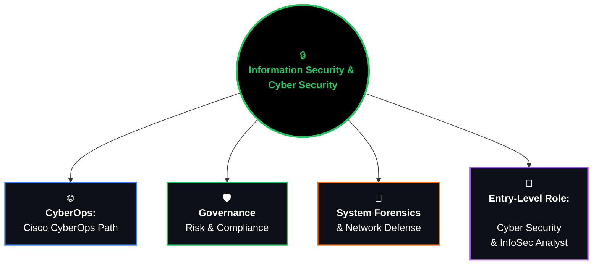

# Hi there, I'm Elikem Amankwah Ofori Dzam 
### *Information Security | Governance, Risk & Compliance (GRC) | IT Support 🔐*

---

## 🧭 About Me

| Icon | Info |
| :---: | :--- |
| 🎓 | **Education** |
| 📚 | **BSc Information Security Student** — specializing in **System Forensics, Cyber Warfare, Cloud Security, & Cryptography** |
| 🛡️ | **Certifications:** Cisco CyberOps Associate · ISC² Certified in Cybersecurity (CC) · Google IT Support |
| 🔍 | **Focus Areas:** Governance, Risk & Compliance (GRC), Digital Forensics, and Threat Analysis |
| 💻 | Hands-on experience with **Nmap, Metasploit, tshark, ExifTool, and Open Policy Agent** |
| 📬 | Open to Information Security, GRC, and Cyber Analysis opportunities |

 

---

## 🗺️ My Cybersecurity Roadmap

---

## 🎓 Academic Curriculum Highlights

<b>Level 200 — Foundation & Systems</b>

 

| Semester | Code | Subject | Theory | Practical | Credits |
|---|---|---|---|---|---|
| Semester I | BIT 201 | Computer Organization & Architecture | 3 | 1 | 3 |
| Semester I | BIT 203 | Object Oriented Programming with C++ | 2 | 3 | 3 |
| Semester I | BIS 201 | Data Communication | 3 | 1 | 3 |
| Semester I | BIS 203 | Managing Risk in Information Systems | 3 | 1 | 3 |
| Semester I | BIT 209 | Data Base Concept and Technologies | 2 | 2 | 3 |
| Semester I | BIT 211 | Linear Algebra | 3 | 0 | 3 |
| Semester II | BIS 202 | Internet Protocols and Security Technologies | 3 | 1 | 3 |
| Semester II | BIT 204 | Object Oriented Programming with Java | 2 | 2 | 3 |
| Semester II | BIT 206 | Operating System Concepts | 3 | 1 | 3 |
| Semester II | BIS 204 | Statistical Computing | 3 | 0 | 3 |
| Semester II | BIS 206 | Computer Networks | 2 | 2 | 3 |
| Semester II | BIT 212 | Database Management System | 2 | 2 | 3 |

<b>Level 300 — Core Security & Engineering</b>

 

| Semester | Code | Subject | Theory | Practical | Credits |
|---|---|---|---|---|---|
| Semester I | BIT 303 | Software Engineering | 3 | 1 | 3 |
| Semester I | BIS 301 | Security Policies and Implementation | 3 | 1 | 3 |
| Semester I | BIS 303 | Access Control and Penetration Testing | 2 | 1 | 2 |
| Semester I | BIS 305 | Web Based Concept and Technologies (Client-Side Scripting) | 2 | 2 | 3 |
| Semester I | BIS 307 | Distributed Networks and Security | 2 | 2 | 3 |
| Semester I | BIT 405 | IT Entrepreneurship | 3 | 1 | 3 |
| Semester I | BIT 304 | Human Computer Interactions | 2 | 1 | 2 |
| Semester II | BIS 302 | System Administration and Security | 2 | 2 | 3 |
| Semester II | BIT 304 | Introduction to Artificial Intelligence | 2 | 1 | 2 |
| Semester II | BIS 304 | Mobile Application Development | 2 | 2 | 3 |
| Semester II | BIS 306 | Operating System Security | 2 | 2 | 3 |
| Semester II | BIT 310 | Research Methods in Computing | 3 | 1 | 3 |
| Semester II | BIT 209 | Principles of Management | 2 | 1 | 2 |
| Semester II | BIS 308 | Web Programming (Server-Side Scripting) | 2 | 2 | 3 |

<b>Level 400 — Advanced Specialization & Research</b>

 

| Semester | Code | Subject | Theory | Practical | Credits |
|---|---|---|---|---|---|
| Semester I | BIS 401 | Application Security | 2 | 2 | 3 |
| Semester I | BIS 403 | Security Technologies Tools and Incident Handling | 2 | 2 | 3 |
| Semester I | BIS 405 | Attachment and Industrial Experience | 0 | 3 | 3 |
| Semester I | Elective | Elective I (System Forensic & Investigation) | 2 | 2 | 3 |
| Semester I | Elective | Elective II (Cyber Warfare) | 2 | 2 | 3 |
| Semester I | BIS 413 | Project I — Written | 1 | 6 | 3 |
| Semester II | BIS 402 | Digital Forensics | 3 | 1 | 3 |
| Semester II | BIT 402 | Ethical and Legal Issues in Computing | 2 | 0 | 2 |
| Semester II | BIS 404 | Emerging Technologies in IT | 2 | 0 | 2 |
| Semester II | Elective | Elective III (Cloud Architecture & Security) | 2 | 2 | 3 |
| Semester II | Elective | Elective IV (Cryptography & Steganography) | 2 | 2 | 3 |
| Semester II | BIS 412 | Project II | 1 | 6 | 3 |

**Elective specializations:**
- **Level 400, Sem I:** System Forensic and Investigation and Response (BIS 407) · Cyber Warfare (BIS 411)
- **Level 400, Sem II:** Cloud Architecture and Security (BIS 406) · Cryptography and Steganography (BIS 410)

---

## 🏆 Certifications

- 🔵 **Cisco Certified CyberOps Associate**
- 🟢 **ISC² Certified in Cybersecurity (CC)**
- 🟡 **Google IT Support Professional**
- 🟡 **Google Cybersecurity Certificate**

---

## 🛠️ Skills & Tools

**Digital Forensics & Recon**

`ExifTool`

**GRC & Policy Enforcement**
`Governance, Risk & Compliance frameworks` · **Open Policy Agent (OPA)** · Policy-as-code · Control mapping (ISO/IEC 27001, NIST CSF)

**Networking & Security**
Packet analysis · System administration · Penetration testing

**Languages**

### 🎯 Security Operations

- Nessus
- OWASP ZAP (Web Testing)
- MITRE ATT&CK Mapping

### ⚙️ Systems & GRC

- NIST & ISO/IEC 27001 Auditing
- Technical SOC Documentation
---

## 📌 Featured Projects

### 🛡️ Technical GRC & Policy Analysis
**Governance · Risk Assessment · Compliance Management · Policy Enforcement**

Applied GRC coursework building typed, evidence-driven decision pipelines rather than checklist-based reviews:
- **Policy-as-code control engine** (Open Policy Agent / Rego) — maps internal control state to ISO/IEC 27001 Annex A and NIST CSF 2.0 identifiers, with fail-closed exception handling
- **Vendor risk verification pipeline** (Python) — cross-checks vendor self-attestations (SIG/SOC 2/DPA) against raw telemetry to surface contradictions, evidence-sufficiency gaps, and undisclosed subprocessors
- **Deterministic ISO/IEC 27001 internal audit engine** — first-match severity classification (design / systemic / recurrence / operating / evidence gaps) applied consistently across 12 Annex A controls, with reproducible, seeded evidence sampling

---

## 📊 GitHub Stats

---

## 🤝 Let's Connect

---

💬 "Every log, every config, every control mapped — one step closer to becoming an Information Security Analyst." 🛡️

